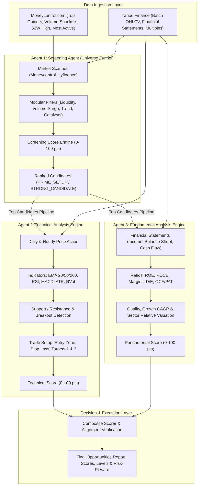

# SwingTrade AI — Multi-Agent Trading System

Deterministic multi-agent trading system for Indian equities (NSE).

- **Agent 1 — Screening Agent**: Screens and ranks Indian equities from **Moneycontrol.com** (Top Gainers, Volume Shockers, 52-Week Highs, Most Active Value, Earnings Catalysts) and **yfinance** (Universe batch scanner for EMA trend alignment, RSI swing sweet-spot, 20-day volume surge, and 52W high proximity) using a deterministic 0–100 candidate score.
- **Agent 2 — Technical Analysis Engine**: Evaluates price trends across daily and hourly timeframes, momentum, volume, breakouts (zero look-ahead bias), key S/R levels, and risk/reward setups.
- **Agent 3 — Fundamental Analysis Engine**: Evaluates quarterly & annual financial statements, revenue/PAT growth, profitability (ROE, ROCE, margins), balance sheet leverage, cash flow quality (OCF, FCF, OCF/PAT), earnings quality, and valuation multiples relative to sector medians.

---

## Architecture



---

## 1. Project Layout

```text
SwingTrade AI/
├── config/
│   ├── settings.yaml                 # Agent 2 settings & weights
│   ├── fundamental_settings.yaml     # Agent 3 settings, sector medians & weights
│   └── screening_settings.yaml       # Agent 1 settings, universes, filters & weights
├── data/
│   ├── raw/                          # Cached market, screening & financial data
│   └── processed/
├── outputs/
│   └── examples/
│       ├── screening_candidates.json # Agent 1 Screening output
│       ├── reliance_analysis.json    # Agent 2 Technical output
│       └── reliance_fundamental.json # Agent 3 Fundamental output
├── src/
│   ├── screening/                    # Agent 1 modules
│   │   ├── main.py                   # Screening CLI and pipeline
│   │   ├── sources/                  # Moneycontrol scraper & yfinance batch scanner
│   │   ├── filters/                  # Technical, volume, liquidity, catalyst filters
│   │   ├── scoring/                  # 0-100 candidate scoring engine
│   │   └── output/                   # JSON formatter, table printer, pipeline dispatcher
│   ├── analysis/                     # Agent 2 technical analysis modules
│   ├── indicators/                   # Moving averages, momentum, volume, volatility
│   ├── scoring/                      # Agent 2 technical scoring
│   ├── risk/                         # Trade levels & stop-loss / targets
│   └── fundamental/                  # Agent 3 modules
│       ├── main.py                   # Fundamental CLI
│       ├── data/                     # Financial statements & valuation metrics
│       ├── ratios/                   # Financial ratios (ROE, ROCE, D/E)
│       ├── analysis/                 # Growth, profitability, balance sheet, cash flow
│       ├── scoring/                  # 100-point fundamental scoring
│       └── output/                   # JSON formatter & LLM explainer
├── tests/
│   ├── conftest.py
│   ├── screening/                    # Agent 1 screening tests
│   ├── test_*.py                     # Agent 2 technical tests
│   └── fundamental/                  # Agent 3 fundamental tests
├── run_all.py                        # Master runner: orchestrates Agent 1, 2, and 3 end-to-end
├── run_screening.py                  # CLI runner for Agent 1
├── run_technical.py                  # CLI runner for Agent 2
├── run_fundamental.py                # CLI runner for Agent 3
├── requirements.txt
└── README.md
```

---

## 2. Installation

```bash
pip install -r requirements.txt
```

---

## 3. Usage

### Master Unified Runner (`run_all.py`)
Run the end-to-end multi-agent pipeline (Screening -> Technical -> Fundamental -> Decision Engine) with a single command:

```bash
# Run all automated tests across all agents
python run_all.py --test

# Run end-to-end pipeline offline (Screen -> Technical -> Fundamental -> Composite Verdicts)
python run_all.py --offline --top-n 3

# Run live market screening and deep pipeline analysis
python run_all.py --universe nifty50 --top-n 5

# Deep-dive on a single stock directly
python run_all.py --symbol RELIANCE --offline

# Export pipeline results as pure JSON
python run_all.py --offline --top-n 3 --json-only --output-file outputs/pipeline_run.json
```

### Agent 1: Screening Agent
```bash
# Run market screening across Moneycontrol and yfinance for NIFTY 50
python run_screening.py --universe nifty50 --min-score 60

# Screen only from Moneycontrol (Volume Shockers, 52W Highs, Top Gainers)
python run_screening.py --source moneycontrol --top-n 10

# Screen only from yfinance
python run_screening.py --source yfinance --universe nifty_next50

# Run offline with deterministic synthetic market data
python run_screening.py --offline --min-score 50

# Output pure JSON
python run_screening.py --offline --json-only

# End-to-End Multi-Agent Pipeline:
# Screen candidates with Agent 1 and pipe top setups directly into Agent 2 & Agent 3
python run_screening.py --offline --run-agents --top-n 3
```

### Agent 3: Fundamental Analysis Engine
```bash
# Run fundamental analysis for RELIANCE
python run_fundamental.py --symbol RELIANCE

# Run offline with cached/synthetic financials
python run_fundamental.py --symbol RELIANCE --offline

# Generate natural-language explanation
python run_fundamental.py --symbol RELIANCE --offline --explain

# Output pure JSON conforming to Section 23
python run_fundamental.py --symbol RELIANCE --offline --json-only
```

### Agent 2: Technical Analysis Engine
```bash
# Run technical analysis for RELIANCE
python run_technical.py --symbol RELIANCE

# Output pure JSON conforming to Section 19
python run_technical.py --symbol RELIANCE --offline --json-only
```

---

## 4. Testing

Run all 71 automated unit tests via pytest:
```bash
pytest -v
```

Or run tests via the master runner:
```bash
python run_all.py --test
```

Run specific test suites:
```bash
pytest -v tests/screening/    # Agent 1 screening tests (23 tests)
pytest -v tests/              # Agent 2 technical analysis tests (17 tests)
pytest -v tests/fundamental/  # Agent 3 fundamental analysis tests (31 tests)
```

---

## 5. Continuous Integration (GitHub Actions)

Continuous integration is configured in [`.github/workflows/agent_1_ci.yml`](.github/workflows/agent_1_ci.yml) and runs on every push and pull request to `main`, as well as on manual dispatch:

- **Agent 1 Dedicated Job**: Runs all 19 unit tests in `tests/screening/` and offline CLI smoke tests (table format, pure JSON, and multi-agent pipeline forwarding).
- **Full System Matrix Job**: Runs the entire 53-test suite across Python 3.11 and Python 3.12 on `ubuntu-latest`.

